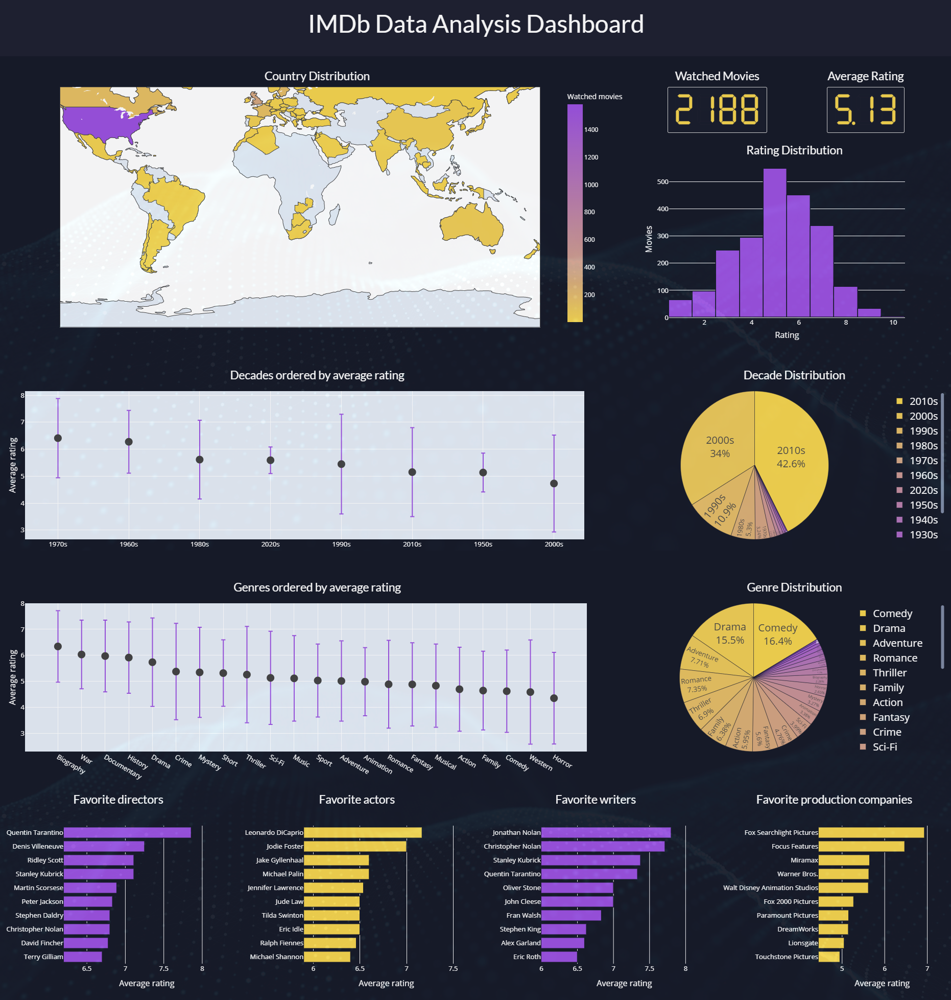

# IMDb Dashboard

## Introduction
I am a huge movie fan, and was very disappointed in the user ratings analysis provided by IMDb. When I discovered that IMDb has a built-in function for exporting user ratings, I decided to use that data to create this dashboard.

## Screenshot



## Built With
* [Dash](https://dash.plot.ly/) - Main server and interactive components 
* [Plotly Python](https://plot.ly/python/) - Used to create the interactive plots

## Requirements
To install all of the required packages to this environment, simply run:

```
pip install -r requirements.txt
```

and all of the required `pip` packages, will be installed, so that the app is able to run.

## How to use this app

Run this app locally by:
```
python dashboard.py
```
Open http://0.0.0.0:8058/ in your browser, and you will see the dashboard.


## What does this dashboard show
This dashboard visualizes a user's movie watching data and preferences, such as total number of movies watched, rating distribution, favorite directors/actors/writers/production companies, as well as the average rating and distribution of genres, decades, and releasing countries. 


